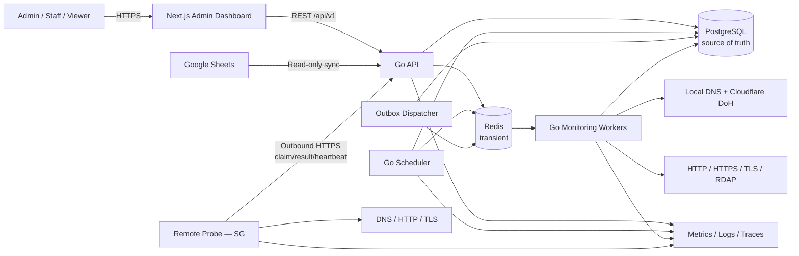
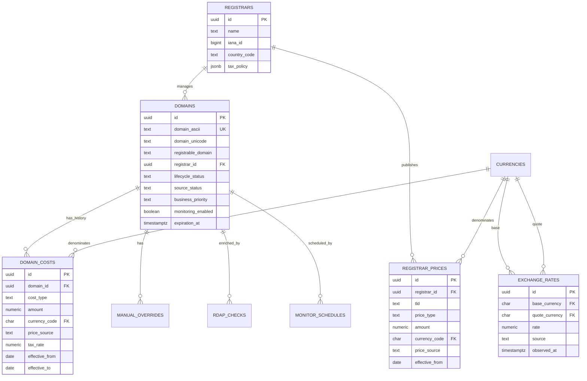
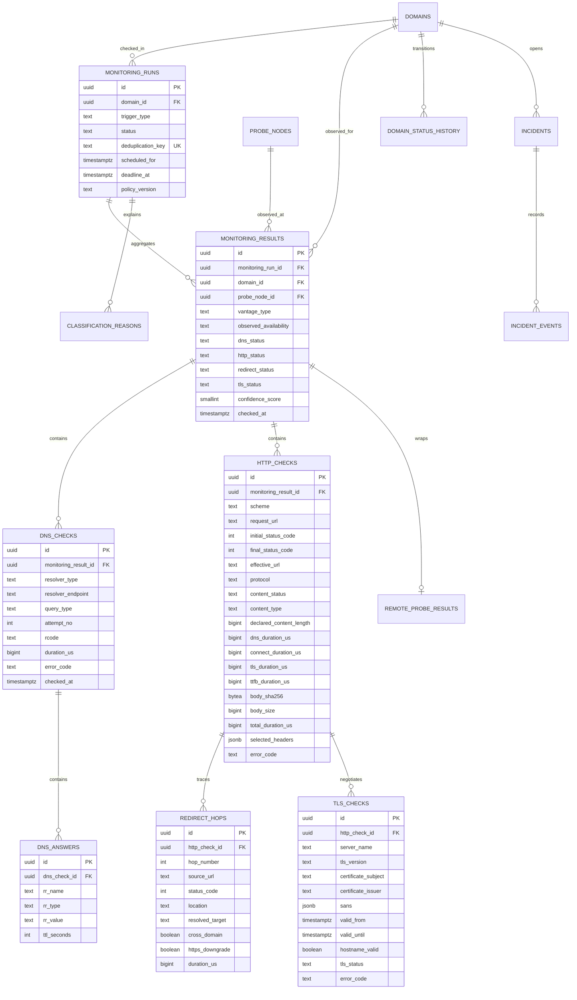
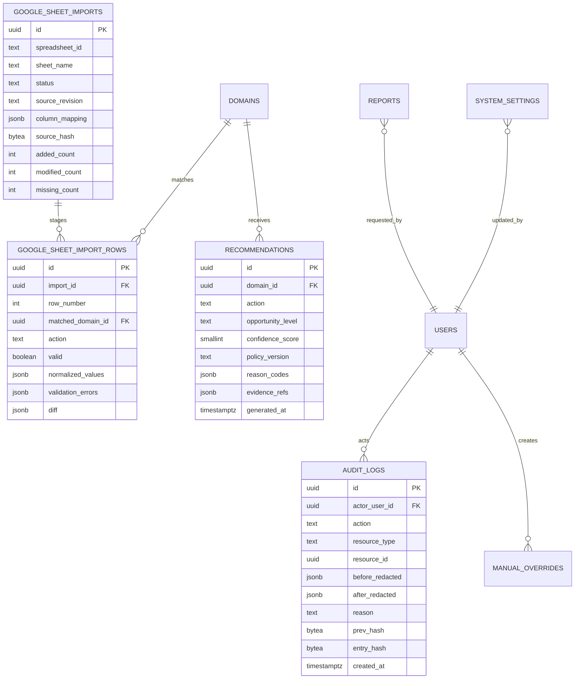
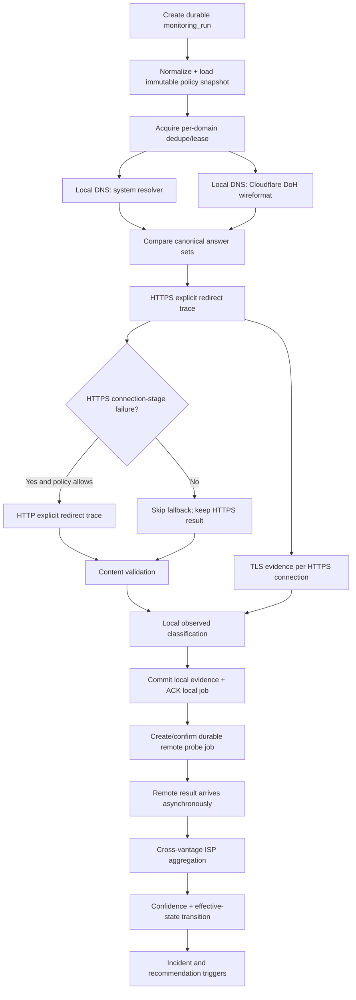
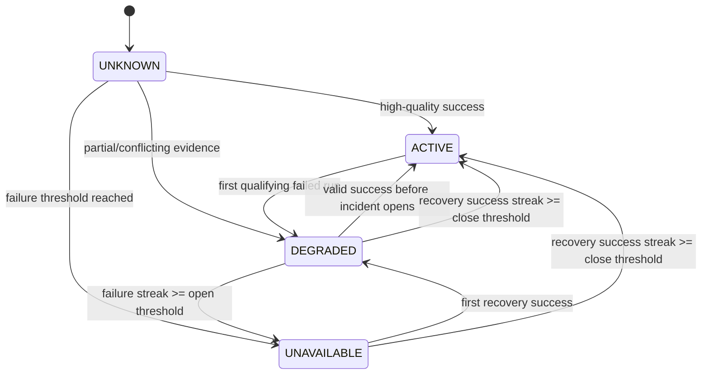
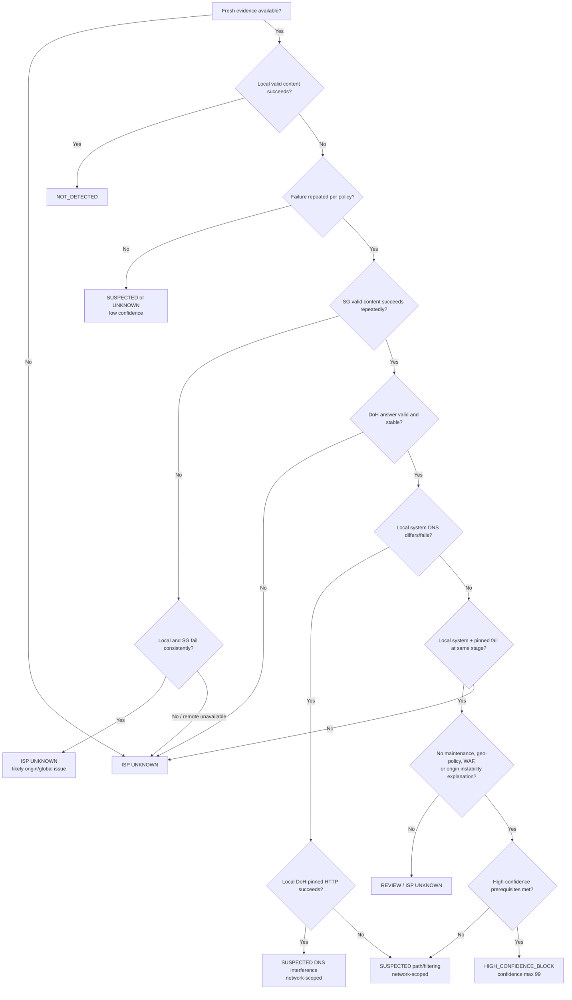
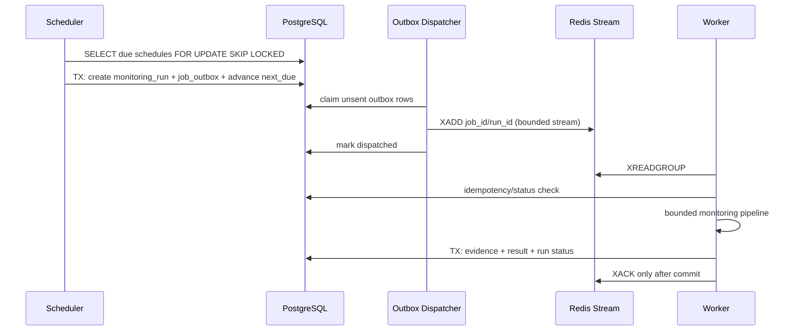
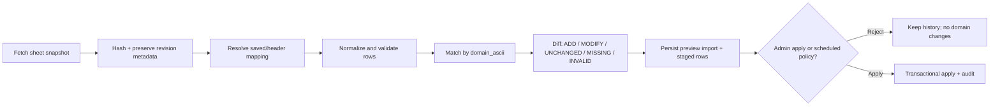

# Domain Monitoring & Asset Intelligence Platform — Architecture

> สถานะเอกสาร: **Approved v1.0 — Implementation Authorized**  
> วันที่: 2026-08-20  
> อนุมัติโดย: Project owner ใน Codex task เมื่อ 2026-08-20  
> ภาษา: ไทย (`th`) และ English (`en`)  
> Review gate: ผ่านแล้ว; เริ่ม Phase 1 ได้ตามหัวข้อ 23

## 1. Executive summary

ระบบนี้จะเริ่มจาก **modular monolith** ที่มี codebase เดียว แต่ build เป็นหลาย process ตามบทบาท ได้แก่ API, scheduler, worker และ remote probe agent โดยมี Next.js admin dashboard แยกเป็น frontend

หลักการสำคัญมีดังนี้:

1. PostgreSQL เป็น permanent source of truth สำหรับ domain, configuration, job intent, monitoring result, evidence, financial data, recommendation และ audit log
2. Redis ใช้เป็น transient transport/coordination เท่านั้น ได้แก่ Redis Streams, short-lived locks, cache และ rate limiting
3. งาน monitoring ใช้ at-least-once delivery และต้อง idempotent; Redis หายได้โดยงานไม่หายถาวร เพราะ PostgreSQL outbox สามารถส่งใหม่ได้
4. ทุก network operation มี deadline และ cancellation; จำนวน goroutine ถูกควบคุมด้วย bounded worker pool และ per-stage semaphore
5. ผลของ request เดียวเป็นเพียง observation ไม่ใช่ definitive domain state; effective state ใช้ multi-signal evidence, retry, history และ hysteresis
6. ISP classification เป็นสถานะแยกจาก availability และต้องระบุขอบเขต network/probe ที่ตรวจ ไม่กล่าวอ้างว่า ISP ทั้งประเทศ block จาก resolver หรือ vantage point เดียว
7. Recommendation เป็น deterministic, versioned rule engine; หากข้อมูลไม่พอให้ `REVIEW`/`UNKNOWN` แทนการเดา
8. Monetary values ใช้ exact decimal ตั้งแต่ PostgreSQL ถึง Go และ JSON API; ห้ามแปลงผ่าน `float64`
9. Raw technical evidence ที่ใช้ตัดสินทุกสถานะต้องย้อนกลับได้ พร้อม policy version, reason codes และ input references
10. Remote probe เป็น independent binary, ไม่มี database credential และสื่อสารกับ platform ผ่าน authenticated HTTPS API เท่านั้น

### 1.1 System context



### 1.2 Quality attribute priorities

ลำดับคุณภาพที่ใช้ตัดสิน trade-off ในทุก phase:

1. **Accuracy:** multi-source/multi-probe evidence, typed errors, `UNKNOWN` เมื่อข้อมูลไม่พอ และไม่ใช้ request เดียวตัดสิน definitive state
2. **Reliability:** durable intent, idempotency, bounded retry, failure isolation, cancellation และ recovery runbooks
3. **High performance:** bounded concurrency, connection reuse/pooling, set-based SQL, backpressure และ capacity admission
4. **Explainability:** deterministic/versioned policies, reason codes, confidence components และ observed/effective state แยกกัน
5. **Auditability:** append-only evidence/history, provenance, policy snapshot, actor/reason และ verifiable archive hash
6. **Scalability:** independently scalable worker/probe processes, partition-ready schema และ measured scale stages
7. **Maintainability:** modular monolith, small packages, explicit interfaces, OpenAPI contract และ phase gates

## 2. Scope, assumptions และ non-goals

### 2.1 Scope ของ MVP

- Single-company, single-tenant internal platform
- Domain inventory และ lifecycle จาก Google Sheet, manual CRUD และ RDAP enrichment
- Local monitoring พร้อม local resolver และ Cloudflare DoH
- HTTPS-first HTTP monitoring, explicit redirect trace, content validation และ TLS inspection
- Singapore remote probe อย่างน้อยหนึ่ง node
- Multi-dimensional status, confidence, incident hysteresis และ historical reporting
- Registrar/cost/expiration/currency/tax/annual budget
- Rule-based recommendation และ indicator-based profit opportunity
- RBAC, audit log, health/readiness และ structured logs
- CSV/JSON export
- Docker Compose development และ production-ready container artifacts

### 2.2 Assumptions

1. Google Sheet เป็น initial inventory source ไม่ใช่ exclusive source ตลอดอายุระบบ; manual/RDAP/registrar data ต้องอยู่ร่วมกันโดยมี field provenance
2. `domain` ในระบบหมายถึง DNS host ที่ต้อง monitor ไม่ได้หมายถึง registrable apex เสมอไป จึง **ไม่ลบ `www.` อัตโนมัติ**; เก็บ `registrable_domain` แยกเพื่อการวิเคราะห์
3. URL path/query ที่ติดมากับ source ใช้เพื่อช่วย parse host เท่านั้นใน MVP; default monitor target คือ origin root `/`
4. Local probe หมายถึง network path ของ monitoring infrastructure ที่ระบุชื่อ, public IP/ASN และตำแหน่งได้ ไม่ใช่ตัวแทน ISP ไทยทุกเครือข่าย
5. SG probe ต้องมี public egress คงที่หรือระบุตัวตน network ได้ เพื่อให้ evidence อธิบายซ้ำได้
6. Traffic, revenue, backlink และ SEO integrations ยังไม่อยู่ใน MVP; “ไม่มี integration” ต้องเป็น `UNKNOWN` ไม่ใช่ค่า 0
7. Corporate OIDC เป็น authentication เป้าหมาย; local bootstrap admin ใช้เฉพาะ deployment ที่ยังไม่มี IdP
8. HTTP/1.1 และ HTTP/2 เป็น baseline; HTTP/3 เป็น capability แบบ opt-in หลังผ่าน compatibility test ไม่ใช่ MVP release gate
9. เวลาในระบบเก็บเป็น UTC (`timestamptz`) และแสดงผลตาม user timezone; ทุก node ต้อง sync เวลาด้วย NTP

### 2.3 Non-goals ของ MVP

- ไม่ประเมินราคาขาย domain เป็นจำนวนเงิน
- ไม่ใช้ LLM ตัดสิน availability, ISP blocking หรือ renewal
- ไม่ทำ active browser rendering/JavaScript execution เพื่อพิสูจน์หน้าเว็บ
- ไม่ทำ WHOIS scraping เป็น primary registration source
- ไม่ทำ active malware scanning, port scanning หรือ network probing นอก 80/443
- ไม่สร้าง microservice ต่อ module
- ไม่รับ arbitrary URL จาก remote-probe job

## 3. Technical risks และ mitigation

| Risk | Impact | Mitigation / architectural decision |
|---|---|---|
| False ISP-block claim | กระทบการตัดสินใจธุรกิจและความน่าเชื่อถือ | Multi-vantage + local system DNS + DoH + local DoH-pinned HTTP + repeated evidence; cap confidence ที่ 99; scope ผลตาม probe network; ใช้ `UNKNOWN` เมื่อ remote evidence ไม่พร้อม |
| Origin/CDN geo policy ถูกตีความเป็น ISP block | False positive | เก็บ CDN headers, resolved IP/ASN, region, status/body hash; ตรวจความต่างแบบ policy; ให้ `REVIEW` เมื่อ geo/WAF/403/451 อธิบายได้หลายแบบ |
| DNS rebinding / SSRF | Probe ถูกใช้เข้าถึง private network/metadata | รับเฉพาะ normalized host, ports 80/443, resolve แล้ว validate IP ทุก hop, pin dial IP, block special-use ranges โดย default, explicit allowlist สำหรับ internal assets |
| 10,000 domains ที่ interval 5 นาที | 2.88M domain runs/day และ DNS rows จำนวนมาก | Monitoring tiers, capacity admission, queue backpressure, native partitioning, retention/archival, per-domain jitter; ห้ามรับ schedule ที่เกิน declared capacity โดยเงียบ |
| Redis loss/restart | Queue message หายหรือส่งซ้ำ | Transactional PostgreSQL outbox, idempotency key, reconciliation และ at-least-once worker semantics |
| Retry storm / thundering herd | ทำให้ target และระบบเสียหาย | Full jitter, per-host/per-registrar rate limit, global semaphore, connection pool limit, circuit breaker สำหรับ remote dependency, schedule jitter |
| Redirect/CDN ทำให้ response body ใหญ่มาก | Memory/disk exhaustion | จำกัด encoded/decoded bytes, streaming hash, excerpt limit, decompression guard, drain/close อย่างจำกัดเพื่อ reuse connection |
| TLS invalid certificate ตรวจรายละเอียดไม่ได้ | Evidence ไม่ครบ | ทำ verified handshake ก่อน; เมื่อ fail จึงทำ diagnostic handshake แบบไม่ verify ที่จำกัดเฉพาะการอ่าน certificate และไม่ส่ง application data |
| Google Sheet accidental deletion | Inventory สูญหาย | Preview/apply สองขั้น, staged rows, missing detection, never hard delete, manual archive precedence, import audit |
| Price/tax ผิดเพราะ source หรือ rounding | Budget ผิด | Decimal end-to-end, explicit source/effective period, tax policy version, currency metadata, configurable rounding at reporting boundary |
| RDAP field ไม่ครบ/ไม่ตรงกัน | Registrar/expiry ผิด | เก็บ raw response hash/excerpt, event source และ fetch time; ไม่ overwrite higher-priority/manual field; unavailable ลด confidence |
| Evidence โตไม่จำกัด | Storage cost / degraded queries | Partition, bounded excerpts, retention classes, summarized history และ cold archive ก่อน prune;เก็บ hash/manifest ใน PostgreSQL |
| Clock skew ระหว่าง probes | ลำดับ evidence ผิด | NTP health, server receipt time, signed probe time, skew warning และ freshness window |
| Rule changes ย้อนอธิบายไม่ได้ | Audit failure | Versioned policy snapshots, immutable recommendation/classification output และ reason codes |

## 4. Technology choices

### 4.1 Backend

| Concern | Choice | Reason |
|---|---|---|
| Language | Go stable release pinned in `go.mod`/CI | เหมาะกับ I/O concurrency, context cancellation และ single static binaries |
| HTTP API | `net/http` + lightweight router | ใช้มาตรฐาน Go เป็นหลักและหลีกเลี่ยง framework lifecycle ที่ซ่อน behavior |
| PostgreSQL driver | `pgx` | Context-aware PostgreSQL access, native types/batch และ explicit transactions |
| SQL | Hand-written SQL + generated typed query layer | เห็น query/index ชัด, ลด runtime reflection และ generic repository ที่ซับซ้อน |
| Migrations | Ordered SQL migrations | Reviewable, reversible เมื่อทำได้, รันเหมือนกันใน CI/dev/prod |
| Redis client | Maintained Go Redis client | รองรับ Streams, consumer groups, scripts และ timeouts |
| DNS | DNS wire-format library + explicit UDP/TCP/DoH transports | ต้องเก็บ RCODE, TTL, answers และ timing ซึ่ง system resolver API อย่างเดียวให้ไม่ครบ |
| IDN | IDNA lookup profile + Public Suffix List | เก็บ Unicode/A-label และ registrable domain โดยไม่เดา |
| Decimal | PostgreSQL `NUMERIC` + Go decimal/value type | ห้ามผ่าน binary floating point; JSON serialize เป็น string |
| Logging | Structured `slog`-compatible logger | Machine-readable fields และ dependency ต่ำ |
| Metrics | Prometheus exposition | เป็นมาตรฐานที่ deploy บน VPS/cloud ได้ง่าย |
| Tracing | OpenTelemetry interfaces | เปิดใช้งานได้ภายหลังโดยไม่ผูก vendor |

ไม่ pin หมายเลข dependency ใน architecture; จะเลือก supported version, pin checksum และบันทึกใน Phase 1 หลังตรวจ compatibility/security จริง

### 4.2 Frontend

- Next.js + TypeScript
- First-class UI locales: Thai (`th`) and English (`en`) with an explicit language selector and persisted user preference
- Server-side/backend-for-frontend calls สำหรับ session-sensitive operations
- Generated API client จาก OpenAPI หลัง API contract เสถียร
- Table virtualization เฉพาะเมื่อข้อมูลบนหน้าจอจำเป็น; pagination/filter ทำ server-side
- Charts ใช้ aggregated report endpoints ไม่ดึง raw checks ทั้งหมดเข้า browser

### 4.3 Data services

- PostgreSQL: canonical state, constraints, immutable evidence metadata, reporting
- Redis Streams: transient job delivery with consumer groups
- Redis cache: RDAP bootstrap, short-lived report cache, rate-limit counters
- Object/archive storage interface: optional production cold evidence archive; development ใช้ local filesystem volume ได้ แต่ metadata/hash อยู่ PostgreSQL

## 5. Process topology และ module boundaries

### 5.1 Deployable processes

| Binary/service | Responsibility | Database access |
|---|---|---|
| `api` | REST, auth/RBAC, CRUD, sync preview/apply, reports, probe control plane | Read/write PostgreSQL; short-lived Redis use |
| `scheduler` | Claim due schedules, create durable runs/outbox, reconcile stale work | Read/write PostgreSQL; Redis lease optional |
| `worker` | Consume local jobs, execute monitoring pipeline, persist evidence/classification | Read/write PostgreSQL; Redis Streams |
| `probe` | Execute restricted remote checks and return signed result | **No direct PostgreSQL/Redis access** |
| `web` | Admin dashboard | API only |
| `migration` | One-shot migration command | PostgreSQL only |

`api`, `scheduler` และ `worker` ใช้ internal packages ชุดเดียวกัน แต่แยก process เพื่อ scale/failure isolation โดยยังคงเป็น modular monolith

### 5.2 Internal boundaries

- `domain`: normalization, lifecycle, source provenance
- `monitor`: orchestration, run budgets, aggregation
- `dnscheck`, `httpcheck`, `tlscheck`, `redirect`: protocol evidence collectors
- `classification`: typed errors, status policy, confidence, state transitions
- `isp`: cross-vantage comparison only; ไม่ทำ network I/O เอง
- `incident`: open/close hysteresis
- `rdap`: IANA bootstrap + rate-limited registration lookup
- `sheets`: mapping, validation, preview/apply
- `finance`: money, tax, FX, budgets
- `recommendation`: versioned deterministic rules
- `report`: queries/exports
- `queue`: outbox, Streams, idempotency, retries
- `probe`: registration, job lease, signed result verification
- `auth`, `audit`, `observability`, `repository`

Domain packages expose use-case interfaces; transport/database implementations อยู่รอบนอก ห้ามให้ HTTP handlers เขียน SQL หรือ classifier เรียก Redis โดยตรง

### 5.3 Extension ports (not implemented in MVP unless listed by a phase)

Stable business-facing interfaces prevent future integrations from leaking vendor models into core rules:

```text
RegistrationProvider    # RDAP now; registrar APIs later
PriceProvider           # registrar API / Sheet / manual / estimate
TrafficProvider         # Google Analytics or another verified source
SearchMetricsProvider   # Search Console / backlink / SEO sources
RevenueProvider         # company revenue source
DNSControlProvider      # Cloudflare or another DNS provider
NotificationSink        # Slack / Discord / LINE / Telegram / email
ReputationProvider      # malware/security reputation
ExchangeRateProvider
EvidenceArchive
ReportRenderer          # CSV/JSON now; XLSX/PDF later
```

Each provider returns value, provenance, observation time, confidence/completeness and typed availability error. Provider absence is `UNKNOWN`, never zero

## 6. Repository structure

```text
/
├── cmd/
│   ├── api/
│   │   └── main.go
│   ├── scheduler/
│   │   └── main.go
│   ├── worker/
│   │   └── main.go
│   ├── probe/
│   │   └── main.go
│   └── migrate/
│       └── main.go
├── internal/
│   ├── app/                 # wiring/config/lifecycle
│   ├── api/                 # REST handlers/middleware/OpenAPI adapters
│   ├── auth/
│   ├── audit/
│   ├── domain/
│   ├── monitor/
│   ├── dnscheck/
│   ├── httpcheck/
│   ├── tlscheck/
│   ├── redirect/
│   ├── classification/
│   ├── isp/
│   ├── incident/
│   ├── rdap/
│   ├── sheets/
│   ├── finance/
│   ├── recommendation/
│   ├── report/
│   ├── queue/
│   ├── probe/
│   ├── repository/
│   │   └── postgres/
│   └── observability/
├── pkg/
│   └── probeprotocol/       # minimal shared signed wire contract
├── migrations/
├── api/
│   └── openapi.yaml
├── web/
├── tests/
│   ├── integration/
│   ├── networkfixtures/
│   └── e2e/
├── deployments/
│   ├── docker/
│   └── examples/
├── docs/
│   ├── runbooks/
│   ├── adr/
│   └── threat-model.md
├── scripts/
├── Dockerfile
├── docker-compose.yml
├── Makefile
├── .env.example
├── go.mod
├── README.md
└── ARCHITECTURE.md
```

`pkg/` มีเฉพาะ protocol ที่ remote probe ต้อง import; package อื่นเป็น `internal/` เพื่อบังคับ boundary

## 7. Data model

### 7.1 Data conventions

- Primary keys: UUID (`uuid`) generated by application/database ตาม policy เดียวกัน
- Time: `timestamptz`, UTC
- Money: `numeric(20,6)`; tax/FX rates: `numeric(20,10)`; currency: ISO-style `char(3)` validated against `currencies`
- Confidence: `smallint CHECK (confidence_score BETWEEN 0 AND 99)`; ไม่ใช้ 100
- Duration: integer microseconds (`bigint`) เพื่อไม่เสีย precision และ query aggregation ได้
- Domain identity: unique `domain_ascii`; เก็บ `domain_unicode`, `registrable_domain`, `original_input`
- Soft lifecycle: `active`, `inactive`, `archived`; source presence แยกเป็น `present`, `missing_from_source`, `unknown`
- Evidence payload ใช้ JSONB เฉพาะ variable/raw fields; field ที่ filter/report บ่อยต้องมี normalized column
- Mutable rows มี `created_at`, `updated_at`, `version`; updates สำคัญใช้ optimistic concurrency
- Evidence/result rows เป็น append-only; correction ทำด้วย superseding row ไม่ update หลักฐานเดิม

### 7.2 Core inventory/finance ERD



### 7.3 Monitoring/evidence ERD



### 7.4 Import/recommendation/audit ERD



### 7.5 Table responsibilities

ตารางที่ requirement ระบุและตารางประกอบมีหน้าที่ดังนี้:

| Table | Responsibility |
|---|---|
| `domains` | Canonical identity, lifecycle, source presence, current effective dimensions, business priority, schedule defaults |
| `registrars` | Registrar identity, IANA ID, API capability และ tax policy defaults |
| `registrar_prices` | Versioned TLD price table by registrar/source/effective period |
| `domain_costs` | Purchase/renewal/manual/estimated cost history; original currency preserved |
| `monitoring_runs` | Durable unit of work, trigger/deadline/policy/idempotency/status |
| `monitoring_results` | Per-vantage aggregate observation; local/remote results never overwrite each other |
| `dns_checks`, `dns_answers` | Resolver/query/attempt/RCODE/TTL/timing/raw evidence |
| `http_checks` | HTTPS and optional HTTP results kept separately, timings/content evidence/error taxonomy |
| `tls_checks` | Certificate/handshake evidence per HTTPS attempt/hop |
| `redirect_hops` | Ordered explicit redirect chain |
| `remote_probe_results` | Signed envelope, probe timestamps, server receipt, signature verification state, raw payload hash |
| `domain_status_history` | Effective state transitions plus previous/current values and supporting run IDs |
| `recommendations` | Immutable versioned rule output and evidence references |
| `google_sheet_imports`, `google_sheet_import_rows` | Preview/apply history, raw source hash, mapping, row validation/diff |
| `reports` | Requested report/export manifest, filters, snapshot time, location/hash/status |
| `system_settings` | Versioned configurable policies; secrets excluded |
| `audit_logs` | Append-only user/system actions with redacted before/after and hash chain |
| `incidents`, `incident_events` | Failure/recovery streaks, open/ack/close history |
| `probe_nodes` | Probe identity, public key, region/network metadata, version, health/last_seen |
| `monitor_schedules` | Per-domain interval, jitter, next/last due, priority |
| `job_outbox` | Durable event awaiting Redis dispatch |
| `rdap_checks` | Registration evidence, bootstrap source, HTTP metadata, normalized fields and raw hash |
| `exchange_rates` | Original rate/source/timestamp; reporting conversion only |
| `manual_overrides` | Original, override, actor, reason, effective/expiry period |
| `users`, `roles`, `user_roles`, `sessions` | Authentication/RBAC; Redis may cache session but role source remains PostgreSQL |

### 7.6 Key constraints and indexes

- `UNIQUE (domain_ascii)` on active and archived records; reactivation reuses row/history ไม่สร้าง duplicate
- `CHECK (domain_ascii = lower(domain_ascii))`
- `CHECK` enum/domain constraints for status/source/currency formats
- `UNIQUE (deduplication_key)` on `monitoring_runs`
- `UNIQUE (monitoring_run_id, probe_node_id, result_kind, attempt_group)` where applicable
- `UNIQUE (http_check_id, hop_number)`
- Partial index `monitor_schedules(next_due_at) WHERE enabled = true`
- Composite indexes:
  - `domains(lifecycle_status, monitoring_enabled, expiration_at)`
  - `domains(current_availability_status, last_checked_at)`
  - `monitoring_runs(domain_id, scheduled_for DESC)`
  - `monitoring_results(domain_id, checked_at DESC)` (domain_id denormalized intentionally for hot history query)
  - `dns_checks(monitoring_result_id, resolver_type, query_type)`
  - `incidents(status, opened_at DESC)`
  - `recommendations(domain_id, generated_at DESC)`
  - `domain_costs(domain_id, cost_type, effective_from DESC)`
- Time-heavy evidence tables partition by `checked_at`/`created_at`; partition policy เริ่มเมื่อ load test ยืนยัน query plan แต่ schema ต้องรองรับตั้งแต่ migration แรก
- Foreign keys ใช้ `RESTRICT` สำหรับ evidence/business rows; ห้าม cascade-delete audit/evidence

### 7.7 Provenance and precedence

ทุก field ที่มาจากหลายแหล่งต้องมี source metadata อย่างน้อย:

```text
value
source_type        registrar_api | google_sheet | manual | rdap | estimate
source_reference   import row / request / override ID
observed_at
effective_from
effective_to
confidence
```

Price precedence คือ `registrar_api > google_sheet > manual_price_table > estimate` **เว้นแต่มี explicit manual override** ซึ่งเก็บแยกและมี expiry/reason ไม่ทำลาย original value

## 8. Domain normalization

### 8.1 Algorithm

1. Trim Unicode whitespace และ reject control characters
2. หาก input parse ได้เป็น URL ให้รับเฉพาะ `http`/`https`, ดึง hostname, reject credentials และเก็บ original input
3. หากไม่มี scheme ให้ parse เป็น hostname; remove trailing root dot หนึ่งตัว
4. Lowercase ตาม DNS/IDNA semantics
5. Convert Unicode labels ด้วย IDNA lookup profile เป็น A-label/punycode
6. Validate label length, total wire length, hyphen/empty-label rules และ reject IP literal
7. เก็บ:
   - `domain_ascii`: canonical unique key เช่น `xn--...`
   - `domain_unicode`: safe display form
   - `registrable_domain`: Public Suffix List result ถ้าหาได้
   - `original_input`: audit only
8. ห้าม remove `www.` หรือ collapse subdomain เข้ากับ apex อัตโนมัติ
9. URL ที่ monitor สร้างจาก ASCII hostname; UI แสดง Unicode พร้อมป้องกัน homograph ด้วยการแสดง A-label คู่กันเมื่อเป็น IDN

### 8.2 Invalid/ambiguous inputs

- Invalid syntax: import row invalid, ไม่ queue monitor
- Public suffix only เช่น `com`: reject
- Unknown suffix: allow only by explicit admin policy; mark validation warning
- Internal/private suffix: reject remote probing โดย default; local internal monitoring ต้องใช้ explicit allowlist
- Duplicate Unicode spellings ที่ map เป็น A-label เดียว: merge/diff ใน preview, ไม่ insert ซ้ำ

## 9. Monitoring pipeline

### 9.1 Run hierarchy



Pipeline stages can execute independent DNS queries concurrently only inside a stage-local bounded group. Parent `context.Context` deadline cancels local DNS, HTTP, TLS, remote-job dispatch and database calls; remote probe execution has its own child job deadline/cancellation state

### 9.2 Default budgets (configurable, not hardcoded in business logic)

| Budget | Proposed default |
|---|---:|
| Full local domain run | 45s |
| Individual DNS attempt | 3s |
| TCP connect | 5s |
| TLS handshake | 7s |
| Response header | 10s |
| Whole HTTP chain | 25s |
| Remote job execution | 45s |
| Platform wait for remote result | async; does not hold local worker |
| Redirect hops | 10 |
| Decoded response body | 2 MiB |
| Stored body excerpt | 32 KiB |
| Response headers stored | allowlist + total 16 KiB cap |

Remote result is asynchronous: local run can finish as `PARTIAL` and aggregator finalizes/reclassifiesเมื่อ SG result arrives within freshness window. Worker ไม่ block connection/goroutine รอ remote node เป็นเวลานาน และ remote update ต้อง idempotent เหมือน local result

### 9.3 DNS checks

Resolvers:

1. `LOCAL_SYSTEM`: query configured local recursive resolver using DNS wire format so RCODE/TTL/error are observable
2. `CLOUDFLARE_DOH`: POST DNS wire message to `https://cloudflare-dns.com/dns-query` with `application/dns-message`

Query types: A, AAAA, CNAME, NS. Store query independently with attempt number, RCODE, flags, resolver endpoint, answers, TTL, duration and typed error

Comparison rules:

- Canonicalize and sort record values; ignore answer order and TTL difference for address-set equality
- Compare RCODE and A/AAAA/CNAME sets for resolution discrepancy
- NS discrepancy is a separate reason because caches/delegation timing may legitimately differ
- `dns_discrepancy=true` does not imply ISP block
- CNAME chains have depth/loop limits and each link is evidence
- UDP truncation (`TC`) retries over TCP within same attempt group
- DoH HTTP errors map to resolver transport error, not DNS RCODE
- Cache use is visible in evidence; monitoring result never fabricates authoritative TTL

### 9.4 HTTP/HTTPS and redirect tracing

- Send `GET`, not `HEAD`, because content validation is required
- HTTPS is attempted first
- HTTP fallback occurs only after connection-stage failure (`DNS`, `TCP`, `TLS`, protocol transport), not merely because HTTPS returned 4xx/5xx
- Disable automatic redirects; process each 301/302/303/307/308 explicitly
- Resolve relative `Location` against source URL
- Reject non-HTTP(S) targets, malformed locations, credential-bearing URLs และ redirect over limit
- Detect loop by normalized URL set, not hop count only
- Mark cross-domain redirect and HTTPS-to-HTTP downgrade per hop
- Preserve `initial_status_code`, `final_status_code`, `primary redirect status` and final target classification
- Reuse shared transports/connection pools; never create a new `http.Client` per check
- Set explicit `User-Agent`, `Accept`, `Accept-Language`; do not store cookies or authenticated state between domains
- Timing uses connection trace: DNS, connect, TLS, TTFB and total; reused connections record unavailable/zero stage timings explicitly rather than inventing values
- Protocol records negotiated `HTTP/1.1`, `HTTP/2`; HTTP/3 capability remains optional

### 9.5 Safe dialing and SSRF controls

Every hop:

1. Resolve hostname using the selected resolver mode
2. Validate all candidate addresses against blocked ranges
3. Select/pin allowed IP for `DialContext`
4. Preserve original Host header and TLS SNI
5. Re-resolve and repeat validation for the next redirect hostname

Blocked by default: loopback, unspecified, link-local, private RFC1918/ULA, multicast, benchmark/documentation ranges, cloud metadata destinations and non-80/443 ports. Company internal domains require named allowlist policy and can never be sent to public remote probes

### 9.6 Content validation

`content_status` is independent from HTTP status:

```text
VALID_HTML
VALID_NON_HTML
EMPTY
TOO_SMALL
NOT_MEANINGFUL
OVERSIZED_TRUNCATED
UNSUPPORTED_CONTENT
UNKNOWN
```

Default website policy requires:

- decoded body exists and size exceeds configurable threshold
- media type is HTML or MIME sniffing indicates HTML
- `<html`, `<body` or normalized meaningful text exists
- body is not whitespace/empty shell according to deterministic threshold

Evidence:

- SHA-256 over streamed decoded body up to policy boundary with explicit `hash_complete` flag
- actual bytes read and declared Content-Length separately
- normalized title with length cap
- first N KiB excerpt after redacting known secrets; excerpt retention class shorter than hash/metadata
- response headers allowlist (`Content-Type`, `Content-Length`, `Server`, cache/CDN/request IDs); never persist `Set-Cookie`, `Authorization` or unrestricted headers

Domain can set `expected_content_mode = HTML | ANY | STATUS_ONLY`; default is `HTML`. API endpoints/assets thereforeไม่ถูก false-negative เพราะ HTML rule เมื่อ admin กำหนด mode อย่างชัดเจน

### 9.7 TLS inspection

- Verified TLS handshake is authoritative for usability
- Record TLS version, cipher suite, leaf subject, issuer, SAN count/list with cap, serial hash, validity, hostname verification and chain error
- Warning thresholds เช่น 30/14/7 days are configurable
- If verified handshake fails, optional diagnostic handshake uses the same pinned target and SNI, disables verification only to collect presented certificate, sends no HTTP data and can never produce `VALID`
- Separate warning/error codes:
  - `TLS_EXPIRED`
  - `TLS_EXPIRING_SOON`
  - `TLS_HOSTNAME_MISMATCH`
  - `TLS_UNKNOWN_AUTHORITY`
  - `TLS_HANDSHAKE_FAILED`
- TLS failure changes `tls_status`; ownership/registration remains independent

### 9.8 Retry policy

Two retry layers are separate:

1. **Operation retry** inside a monitoring result for transient network failure
2. **Job delivery retry** when worker/process/infrastructure fails before durable completion

Operation retry defaults to maximum 3 attempts with exponential backoff and full jitter under the original global deadline. Retryable examples: timeout, temporary DNS transport error, connection reset, selected 408/425/429/502/503/504 respecting bounded `Retry-After`. Non-retryable examples: NXDOMAIN with valid DNS response, certificate expiry/hostname mismatch, stable 301/404/451, invalid content policy

Every attempt is stored. Classifier uses typed error code and attempt outcome; business logic must not parse error strings

### 9.9 Error taxonomy

```text
NORMALIZATION_INVALID
DNS_NXDOMAIN
DNS_SERVFAIL
DNS_REFUSED
DNS_TIMEOUT
DNS_NETWORK_ERROR
DNS_MALFORMED_RESPONSE
TCP_TIMEOUT
TCP_REFUSED
TCP_RESET
TLS_EXPIRED
TLS_HOSTNAME
TLS_UNKNOWN_AUTHORITY
TLS_HANDSHAKE
HTTP_TIMEOUT
HTTP_4XX
HTTP_5XX
HTTP_REDIRECT_LOOP
HTTP_REDIRECT_LIMIT
HTTP_MALFORMED_LOCATION
HTTP_HTTPS_DOWNGRADE
CONTENT_EMPTY
CONTENT_TOO_SMALL
CONTENT_NOT_MEANINGFUL
CONTENT_TOO_LARGE
REMOTE_PROBE_UNAVAILABLE
REMOTE_PROBE_STALE
REMOTE_PROBE_INVALID_SIGNATURE
RUN_CANCELLED
RUN_DEADLINE_EXCEEDED
INTERNAL_PERSISTENCE_ERROR
```

Go errors expose stable code/stage/retryability and wrap original cause; persistence stores safe message separatelyจาก debug detail

## 10. Status and confidence model

### 10.1 Independent dimensions

| Dimension | Values |
|---|---|
| `availability_status` | `ACTIVE`, `UNAVAILABLE`, `DEGRADED`, `UNKNOWN` |
| `dns_status` | `OK`, `NXDOMAIN`, `SERVFAIL`, `REFUSED`, `TIMEOUT`, `NETWORK_ERROR`, `DISCREPANCY`, `UNKNOWN` |
| `http_status` | `OK`, `REDIRECT`, `CLIENT_ERROR`, `SERVER_ERROR`, `TIMEOUT`, `CONNECTION_ERROR`, `UNKNOWN` |
| `redirect_status` | `NONE`, `TEMPORARY`, `PERMANENT`, `LOOP`, `INVALID`, `HTTPS_DOWNGRADE`, `UNKNOWN` |
| `isp_status` | `NOT_DETECTED`, `SUSPECTED`, `HIGH_CONFIDENCE_BLOCK`, `UNKNOWN` |
| `tls_status` | `VALID`, `EXPIRING`, `EXPIRED`, `HOSTNAME_MISMATCH`, `INVALID`, `ERROR`, `NOT_APPLICABLE`, `UNKNOWN` |
| `content_status` | values from section 9.6 |
| `recommendation_action` | `RENEW`, `DROP`, `REVIEW`, `PROFIT_OPPORTUNITY` |
| `opportunity_level` | `UNKNOWN`, `LOW`, `MEDIUM`, `HIGH` |

`PROFIT_OPPORTUNITY` เป็น tag/presentation derived จาก `opportunity_level=HIGH` ไม่ใช่ action ที่มาแทน `RENEW/DROP/REVIEW` เพราะ domain เดียวสามารถควรต่ออายุและมี profit opportunity พร้อมกันได้

ตัวอย่างที่ถูกต้อง:

```json
{
  "availability_status": "ACTIVE",
  "http_status": "REDIRECT",
  "redirect_status": "PERMANENT",
  "initial_http_status_code": 301,
  "final_target_status": "ACTIVE",
  "tls_status": "VALID",
  "isp_status": "NOT_DETECTED"
}
```

### 10.2 Observed result vs effective state

- `monitoring_results.*`: สิ่งที่ probe สังเกตใน run นั้น ไม่แก้ย้อนหลัง
- `domains.current_*`: effective state หลังใช้ policy/history/hysteresis
- `domain_status_history`: บันทึกเฉพาะ transition ของ effective state พร้อม run IDs และ reason codes

จึงสามารถแสดงทั้ง “request ล่าสุด timeout” และ “effective state ยัง DEGRADED รอยืนยัน” โดยไม่โกหกว่าระบบ active หรือ down แน่นอน

### 10.3 Availability classification matrix

| Evidence | Observed availability | HTTP dimension |
|---|---|---|
| DNS success + final 2xx + valid expected content | `ACTIVE` | `OK` หรือ `REDIRECT` ถ้ามี hop |
| Final 2xx แต่ content empty/invalid | `DEGRADED` | `OK` |
| Reachable final 4xx รวม 403/451 | `DEGRADED` | `CLIENT_ERROR` |
| Final 5xx after bounded retry | `UNAVAILABLE` | `SERVER_ERROR` |
| DNS/TCP/TLS/HTTP timeout after bounded retry | `UNAVAILABLE` | stage-specific |
| Conflicting/incomplete/cancelled evidence | `UNKNOWN` | evidence-specific |
| Permanent redirect to final active content | `ACTIVE` | `REDIRECT` + `PERMANENT` |
| Redirect loop/invalid chain | `UNAVAILABLE` | `REDIRECT` + loop/invalid |

`failure_stage`, `error_code`, `safe_error_message` are mandatory when observed availability is not `ACTIVE`

### 10.4 Effective availability state machine

Default thresholds: open incident after 3 consecutive qualifying failures; close after 2 consecutive successes. Thresholds are versioned settings and can vary by priority



Rules:

- Non-qualifying run (`CANCELLED`, platform persistence failure, stale probe) does not increment domain failure streak
- A failed run caused solely by remote probe unavailable does not turn an otherwise local-active domain unavailable
- Manual check and scheduled check use same classifier, but manual checks do not reset incident streak unless policy explicitly allows
- Schedule gaps never count as success/failure; report monitoring coverage separately

### 10.5 Confidence engine

Every output stores:

```text
confidence_score: 0..99
confidence_level: LOW (0..49) | MEDIUM (50..79) | HIGH (80..99)
policy_version
reason_codes[]
supporting_evidence_ids[]
conflicting_evidence_ids[]
```

Deterministic score:

```text
score = clamp(
  policy_base
  + evidence_completeness
  + repeatability
  + independent_corroboration
  + freshness
  - conflicts
  - stale_or_missing_penalty,
  0, 99
)
```

แต่ละ component เป็น integer table ใน policy version ไม่ใช่ model inference ตัวอย่าง intent:

- Single DNS timeout only: observed `UNAVAILABLE`, confidence ประมาณ 30–40
- Local DNS + DoH + HTTP valid content: `ACTIVE`, confidence สูงแต่ยังไม่ 99 หากไม่มี history
- 3 repeated local failures + repeated SG failures at same stage: `UNAVAILABLE`, confidenceประมาณ 90–99
- Local failure + SG success แต่ SG evidence stale: `UNKNOWN`/`SUSPECTED` low-medium ไม่ใช่ high-confidence block

### 10.6 Monitoring history and aggregate definitions

รองรับ windows `24h`, `7d`, `30d`, `90d` และ arbitrary bounded range โดยใช้ effective-state intervals จาก `domain_status_history` ไม่ใช้จำนวน rows แบบง่ายซึ่งจะผิดเมื่อ schedule เปลี่ยน

```text
known_seconds = active_seconds + degraded_seconds + unavailable_seconds
uptime_percentage = active_seconds / known_seconds * 100
monitoring_coverage = known_seconds / requested_window_seconds * 100
```

Rules:

- `UNKNOWN` และช่วงที่ไม่มี check ไม่ถูกนับเป็น active และไม่อยู่ใน uptime denominator; ต้องแสดง `monitoring_coverage` คู่กับ uptime เสมอเพื่อไม่ทำให้ข้อมูลที่ขาดดูดี
- Permanent redirect ที่ final target `ACTIVE` นับ availability เป็น active แต่ report redirect แยกมิติ
- `average_response_time` คำนวณจาก qualifying completed HTTP results และต้องระบุว่าเป็น mean/p50/p95; timeout ไม่ถูกแปลงเป็นค่าระยะเวลาปลอม แต่มี timeout rate แยก
- `incident_count` คือจำนวน incident ที่เปิดใน window; incident ที่คาบช่วง window ต้องแสดง separately as impacted incidents
- `status_change_count` นับ effective transitions; raw transient observations query ได้แยก
- Rollups เก็บ numerator/denominator/count/sum/histogram components เพื่อ aggregate ข้ามช่วงได้อย่างถูกต้อง ไม่เก็บเฉพาะ percentage ที่นำมาเฉลี่ยต่อไม่ได้

## 11. ISP detection design

### 11.1 Signals

เพื่อแยก DNS manipulation ออกจาก network-path behavior local worker สร้าง observations เพิ่มเติม:

1. `local_dns_system`: DNS ผ่าน resolver ของ network หลัก
2. `local_dns_doh`: Cloudflare DoH wireformat
3. `local_http_system_dns`: HTTP(S) จาก local path โดยใช้ local DNS
4. `local_http_doh_pinned`: HTTP(S) ยังออกจาก **local path เดิม** แต่ pin ไปยัง DoH-validated IP พร้อม Host/SNI เดิม
5. `remote_sg`: DNS + HTTP + TLS + redirect + content จาก SG

ข้อ 4 ไม่ใช่ foreign traffic; ใช้พิสูจน์ว่าปัญหาอยู่ที่ DNS หรือ path เท่านั้น

### 11.2 Decision tree



### 11.3 High-confidence prerequisites

All conditions required:

- At least 3 qualifying local failures spanning at least 2 scheduled time buckets
- At least 2 fresh SG successes with valid expected content/body hash evidence
- Local DoH answers stable and compatible with SG answers/origin behavior
- Local system and DoH-pinned requests fail consistently at a filtering-compatible stage, or DNS alteration signal is deterministic
- Target is not in maintenance window
- No concurrent global/origin incident
- No obvious WAF/geo-block/authorization/CDN configuration explanation; 403/451 alone is insufficient
- Probe identity/network metadata and clocks are healthy
- Policy version records exact thresholds and scoring

With only local + one SG region, result wording remains “high-confidence block on the monitored local network path”, not universal/legal confirmation. A manually verified ISP notice or second independent Thai/foreign vantage may be stored as additional evidence but confidence never becomes 100

### 11.4 Example reason codes

```text
LOCAL_DNS_RCODE_DIFFERS
LOCAL_DNS_ANSWER_SET_DIFFERS
DOH_ORIGIN_IP_STABLE
LOCAL_SYSTEM_HTTP_FAILED
LOCAL_DOH_PINNED_HTTP_FAILED
REMOTE_SG_CONTENT_VALID
REMOTE_SG_BODY_HASH_STABLE
LOCAL_FAILURE_REPEATED
ORIGIN_GLOBAL_FAILURE
REMOTE_EVIDENCE_MISSING
REMOTE_EVIDENCE_STALE
POSSIBLE_GEO_POLICY
POSSIBLE_WAF_BLOCK
```

## 12. Queue, scheduler and concurrency

### 12.1 Durable scheduling flow



PostgreSQL row locking with `SKIP LOCKED` allows scheduler/dispatcher replicas share queue-like rows; unique `deduplication_key` remains final duplicate guard

### 12.2 Redis Streams semantics

- Consumer group provides at-least-once delivery
- Pending entries exceeding lease are reclaimed (`XAUTOCLAIM`/equivalent supported command)
- Crash after DB commit but before ACK causes redelivery; worker sees completed run and ACKs without duplicate evidence
- Poison job has bounded delivery count; final failure stored in `monitoring_runs`/audit และ optional transient DLQ stream
- Stream trimming occurs only after durable reconciliation window; Redis history is not audit history
- If Redis is unavailable, scheduler continues creating durable outbox within a bounded backlog; admission control stops creating excessive new work

### 12.3 Deduplication

Scheduled job key:

```text
monitor:{domain_id}:{schedule_slot_utc}:{policy_version}:{vantage_plan}
```

Manual checks use client `Idempotency-Key` plus domain/user/time-bound scope. A domain normally has one active local run; admin “force” creates a new run only with explicit reason and separate rate limit

### 12.4 Scheduler

- One centralized scheduler design; multiple replicas safe through PostgreSQL locks/unique keys
- Optional Redis lease reduces duplicate scanning but correctness does not depend on the lease
- `next_due_at` includes stable per-domain jitter to avoid synchronized bursts
- Priorities: critical, normal, low; use separate Streams and weighted consumption to avoid starvation
- No cron per domain
- Missed schedules coalesce to latest due slot by default; do not enqueue every historical missed interval after outage
- Per-domain interval choices are policy values (5m, 15m, 30m, 1h, 6h, 24h) with capacity validation

### 12.5 Bounded concurrency and backpressure

- Top-level worker pool fixed by `MONITOR_WORKERS`
- Separate semaphores for DNS, HTTP, RDAP and remote dispatch to prevent one stage monopolizing workers
- Per-host and per-registrar token buckets
- PostgreSQL connection pool max below database capacity; worker count and DB pool are independently tuned
- HTTP transport connection limits and idle connection lifetimes configured
- Queue high-water marks:
  - warn and expose metric
  - delay low-priority schedules
  - coalesce overdue work
  - reject/429 excessive manual checks
- No unbounded goroutine, channel, response body, retry or queue

### 12.6 Query and connection performance

- Domain list/detail/report use purpose-built SQL projections; do not load a domain list แล้ว query status/cost/recommendation ทีละ row (N+1 queries)
- Current status/cost/recommendation can use explicit latest-pointer IDs or transactionally refreshed summary projection; raw history remains append-only
- Detail endpoint batch-loads checks/answers/hops by result IDs with bounded page limits
- Reports run set-based aggregation against indexed columns/rollups and use a read-only transaction snapshot for consistency
- `sql.DB`/driver pool limits, idle count, idle lifetime and connection lifetime are configured and exposed as metrics; values must stay below PostgreSQL connection budget across all replicas
- Every `Rows`, response body and network connection is closed on all paths; leak/race/soak tests are release gates
- Explain plans for hot list/history/report queries are captured in integration/load tests before production release

## 13. Remote probe architecture

### 13.1 Control flow

Remote probes use outbound-only HTTPS, suitable behind NAT/firewall:

Probe metadata uses generic region/country/network identifiers so the same binary can support `TH`, `SG`, `JP`, `US` or future regions; MVP deployment gate requires local primary + at least one healthy `SG` node

```text
POST /api/v1/probe-auth/register       one-time bootstrap
POST /api/v1/probe-auth/token          signed challenge -> short-lived token
POST /api/v1/probe-agent/heartbeat
POST /api/v1/probe-agent/jobs/claim    long-poll with bounded timeout
POST /api/v1/probe-agent/jobs/{id}/result
```

These SYSTEM endpoints are separate from human `/api/v1/probes` admin endpoints

### 13.2 Identity and authentication

1. Admin creates one-time, short-expiry registration token bound to expected region/name
2. Probe generates Ed25519 key pair locally and registers public key
3. Probe signs server challenge to obtain short-lived scoped access token
4. Every result includes payload hash, nonce, job ID, issue time and Ed25519 signature
5. Server validates token, signature, nonce replay, lease ownership, payload limits and clock skew
6. Key rotation/revocation is audited; private key never leaves probe node

TLS is mandatory. mTLS can be added for high-security deployments without changing job/result contract

### 13.3 Job contract

```json
{
  "job_id": "uuid",
  "run_id": "uuid",
  "target": {
    "domain_ascii": "example.com",
    "schemes": ["https", "http"],
    "ports": [443, 80]
  },
  "policy_version": "monitor-2026-08-v1",
  "policy": {
    "deadline_ms": 45000,
    "max_redirects": 10,
    "max_body_bytes": 2097152,
    "store_excerpt_bytes": 32768
  },
  "issued_at": "2026-08-20T03:00:00Z",
  "expires_at": "2026-08-20T03:02:00Z",
  "nonce": "..."
}
```

Server never sends arbitrary method, headers, credentials, request body, port or URL path. Probe independently applies SSRF policy and returns policy rejection as evidence

### 13.4 Result contract

Result includes protocol version, probe identity/version/region/country/network, job/run IDs, started/finished timestamps, local clock status, all bounded DNS/HTTP/TLS/redirect/content evidence, typed errors, payload hash and signature. Platform stores original signed envelope hash plus normalized queryable fields

### 13.5 Probe health

- `ONLINE`, `DEGRADED`, `OFFLINE`, `REVOKED`, `UPGRADE_REQUIRED`
- Heartbeat records version, capabilities, NTP offset, queue capacity and egress public IP hash/value according to privacy policy
- Scheduler excludes stale/degraded probes and reports coverage gap; it does not substitute stale evidence

## 14. RDAP and Google Sheets

### 14.1 RDAP

- Discover authoritative base URL from IANA RDAP DNS bootstrap using the A-label TLD
- Cache bootstrap with source timestamp/ETag and bounded refresh; stale cache can be used only with warning when IANA is temporarily unavailable
- Rate limit by RDAP base URL/registrar, honor bounded `Retry-After`, cache successful result
- Normalize registrar, registrar IANA ID, events (registration/expiration/updated), nameservers, DNSSEC and domain statuses when present
- Missing field remains null with `source=unavailable`; no inferred date/name
- Keep response status, headers allowlist, fetch time, raw payload hash and bounded raw payload/archive reference
- RDAP never silently overwrites Google/manual value; conflict becomes explicit provenance/review reason

### 14.2 Google Sheet proposed columns

```text
domain
registrar
purchase_price
renewal_price
currency
tax_rate
purchase_date
expiration_date
business_priority
notes
active
```

Importer maps semantic fields by saved header mapping, not fixed column index. Header aliases can be configured, but ambiguous matches require user confirmation

### 14.3 Preview/apply workflow



Apply rules:

- `ADD`: create domain and source provenance
- `MODIFY`: update only sheet-owned fields unless a live manual override exists
- `MISSING`: set `source_status=missing_from_source`; never hard delete
- Sheet `active=false`: set source activity flag/monitor policy as approved, not erase history
- Reappearing row sets source present again; explicit manual archive remains until admin changes it
- Duplicate normalized domains, invalid decimal/currency/date/boolean and conflicting rows block those rows; policy decides whether partial apply is allowed. Default: atomic apply of all valid rows with invalid rows explicitly excluded and counted
- Manual and scheduled sync share a distributed lease/idempotency guard

## 15. Finance and recommendation

### 15.1 Money model

API represents money as strings:

```json
{
  "amount": "1450.000000",
  "currency": "THB",
  "source": "google_sheet"
}
```

No JSON number is accepted for monetary write endpoints unless parser guarantees exact lexical decimal; preferred contract is string

### 15.2 Renewal/tax/annual cost

```text
tax_amount = taxable_base * applicable_tax_rate
renewal_total = renewal_price + tax_amount
annual_cost = renewal_total * (12 / billing_cycle_months)
```

All operations use decimal and explicit rounding policy at display/report boundary. Tax policy fields include jurisdiction, billing entity, inclusive/exclusive mode, rate source, effective period and manual override. VAT is never hardcoded

If billing cycle does not divide 12 exactly, report both cycle total and normalized annual estimate with formula metadata. Missing tax rate produces `estimated_tax = UNKNOWN`, not zero, unless policy explicitly says tax exempt

### 15.3 FX conversion

- Original amount/currency immutable
- Conversion is report-time snapshot using `exchange_rates`
- Store exchange rate, source, timestamp, base/quote, converted amount and rounding policy in report manifest
- Stale/missing rate causes partial report warning; never reuse silently beyond configured freshness

### 15.4 Budget windows

Summary aggregates:

- total current acquisition cost (clearly labeled historical)
- renewal price, estimated tax, renewal total, normalized annual budget
- expiry/renewal windows: next 30/60/90 days and current calendar/fiscal year
- unknown-cost/unknown-tax domain counts shown beside totals so incomplete totals are not presented as complete

### 15.5 Recommendation engine

Order of evaluation:

1. Active manual override (show original engine result alongside override)
2. Evidence readiness gate
3. Business-critical/production protection rules
4. Expiry urgency and cost completeness
5. Availability/incident/history/redirect/usage rules
6. Opportunity indicators
7. Conservative fallback `REVIEW`

Input facts are versioned and provenance-aware:

| Input group | MVP state |
|---|---|
| Monitoring dimensions/confidence, incidents, downtime/uptime, redirect target/history | Implemented from internal evidence |
| Expiration, renewal/annual cost, registrar, source completeness | Implemented from Sheet/manual/RDAP/finance |
| Usage status, business importance, manual priority | Explicit inventory fields/manual override |
| Duplicate/overlapping domain signal | Conservative normalized/registrable-domain and manually confirmed relationship; no automatic DROP |
| Traffic, revenue, historical usage analytics, inbound links | Extension facts; `UNKNOWN` until a verified provider is connected |

Safety rules:

- `DROP` requires explicit evidence that domain is not production/business-critical plus policy-specific inactivity/history; missing traffic/revenue integrations cannot be treated as “no traffic/revenue”
- Production or high-priority domain defaults toward `RENEW`/`REVIEW`, never automatic `DROP` solely due temporary outage/ISP signal
- Redirect to primary domain is supporting evidence only; it does not prove no email, API, DNS or brand use
- Expiration approaching with incomplete business data => `REVIEW` urgent
- Every result stores `policy_version`, input snapshot, reason codes, human-readable localized reasons and confidence

Example deterministic rules:

| Priority | Condition | Action |
|---:|---|---|
| 10 | Active admin override | Override action; preserve engine proposal |
| 20 | Expiry <= threshold and criticality HIGH | `RENEW` |
| 30 | Required cost/expiry/usage data missing | `REVIEW` |
| 40 | Long-term unavailable + no known service dependencies + verified zero usage/revenue + low priority | `DROP` |
| 50 | Active or redirect-to-primary + known business use | `RENEW` |
| 99 | Otherwise | `REVIEW` |

### 15.6 Profit opportunity indicator

Separate weighted indicators: length band, dictionary/keyword evidence source, TLD class, pronounceability/brandability heuristic, known historical use, verified traffic/revenue, acquisition and renewal cost. Missing metrics reduce completeness and confidence

Output is `UNKNOWN/LOW/MEDIUM/HIGH` with indicator contributions and reasons. No sale-price amount is generated

## 16. REST API design

### 16.1 Conventions

- Base path `/api/v1`
- JSON UTF-8; timestamps RFC 3339 UTC
- Stable machine error code plus safe message and `request_id`
- Mutating async actions return `202 Accepted` with operation/run ID
- Pagination is server-side; default 50, max configurable 200
- Sort/filter fields are allowlisted; SQL identifiers never come from raw user input
- `Idempotency-Key` required for manual check/import apply/report generation
- Optimistic concurrency via `ETag`/`If-Match` or explicit `version`
- OpenAPI is contract source and CI validates implementation/client
- `Accept-Language` รองรับ `th`/`en`; user profile locale เป็น fallback และ deployment default กำหนดได้
- Stable error/reason codes ไม่แปลใน database; API เลือก localized message จาก versioned translation catalog และสามารถส่งทั้ง `messages.th`/`messages.en` สำหรับ audit/client fallback
- User-entered notes/names เก็บตามต้นฉบับ ไม่ machine-translate อัตโนมัติ

Error envelope:

```json
{
  "error": {
    "code": "DOMAIN_ALREADY_EXISTS",
    "message": "The normalized domain already exists.",
    "request_id": "uuid",
    "details": {"domain_ascii": "example.com"}
  }
}
```

### 16.2 Domains

```text
GET    /api/v1/domains
POST   /api/v1/domains
GET    /api/v1/domains/{domain_id}
PATCH  /api/v1/domains/{domain_id}
POST   /api/v1/domains/{domain_id}/archive
POST   /api/v1/domains/{domain_id}/restore
POST   /api/v1/domains/{domain_id}/checks
GET    /api/v1/domains/{domain_id}/checks
GET    /api/v1/domains/{domain_id}/history
GET    /api/v1/domains/{domain_id}/evidence/{result_id}
GET    /api/v1/domains/{domain_id}/costs
POST   /api/v1/domains/{domain_id}/overrides
DELETE /api/v1/domains/{domain_id}/overrides/{override_id}
```

Domain list filters: query, availability, DNS, HTTP/redirect, ISP, TLS, lifecycle/source state, expiry range, registrar, recommendation, priority, last-checked range

### 16.3 Incidents/recommendations/reports

```text
GET   /api/v1/incidents
GET   /api/v1/incidents/{incident_id}
POST  /api/v1/incidents/{incident_id}/acknowledge
GET   /api/v1/recommendations
GET   /api/v1/domains/{domain_id}/recommendations
POST  /api/v1/domains/{domain_id}/recommendations/recompute
POST  /api/v1/domains/{domain_id}/recommendations/override
GET   /api/v1/reports/summary
POST  /api/v1/reports
GET   /api/v1/reports/{report_id}
GET   /api/v1/reports/{report_id}/download
```

`GET /reports/summary` includes total/active/unavailable/redirect-301/suspected/high-confidence ISP/DNS/TLS/expiring, renew/drop/review/opportunity counts, renewal/tax/budget totals and unknown-data counts

### 16.4 Google Sheets

```text
GET   /api/v1/google-sheets/config
PUT   /api/v1/google-sheets/config
POST  /api/v1/google-sheets/sync-previews
GET   /api/v1/google-sheets/imports
GET   /api/v1/google-sheets/imports/{import_id}
POST  /api/v1/google-sheets/imports/{import_id}/apply
POST  /api/v1/google-sheets/imports/{import_id}/reject
```

### 16.5 Probe administration

```text
GET   /api/v1/probes
POST  /api/v1/probes/registration-tokens
GET   /api/v1/probes/{probe_id}
PATCH /api/v1/probes/{probe_id}
POST  /api/v1/probes/{probe_id}/revoke
POST  /api/v1/probes/{probe_id}/rotate-key
```

Probe agent protocol endpoints from section 13 use SYSTEM auth and are inaccessible to human browser sessions

### 16.6 Settings/audit

```text
GET   /api/v1/settings
PATCH /api/v1/settings/{key}
GET   /api/v1/audit-logs
GET   /api/v1/users
PATCH /api/v1/users/{user_id}/roles
GET   /health
GET   /ready
GET   /metrics
```

`/health` checks process liveness only; `/ready` checks required dependencies with short budget. `/metrics` is network-restricted/authenticated in production

## 17. Security and auditability

### 17.1 RBAC

| Capability | SYSTEM | ADMIN | STAFF | VIEWER |
|---|:---:|:---:|:---:|:---:|
| Probe claim/result | ✓ | – | – | – |
| User/role/secrets/config administration | – | ✓ | – | – |
| Domain/price/schedule edit | – | ✓ | ✓ (policy-limited) | – |
| Import preview | – | ✓ | ✓ | – |
| Import apply/archive/override recommendation | – | ✓ | policy-limited | – |
| Manual check | – | ✓ | ✓ | – |
| Read dashboard/report/evidence | – | ✓ | ✓ | ✓ (sensitive evidence redacted) |

Authorization enforced in service layer, not UI only. SYSTEM credentials cannot call human administration endpoints

### 17.2 Authentication/session

- Prefer OIDC Authorization Code + PKCE with corporate IdP
- Backend-issued secure session cookie: `HttpOnly`, `Secure`, `SameSite=Lax/Strict` according to flow, rotation and short inactivity timeout
- CSRF protection on cookie-authenticated writes
- Bootstrap local admin disabled after OIDC setup; passwords if used store with approved memory-hard hash and rate limiting
- Role changes revoke/refresh active sessions

### 17.3 Secrets

- Environment/secret manager only: database credentials, Redis auth/TLS, OIDC secret, Google service-account credential, probe signing/token keys
- `.env.example` contains names and safe placeholders only
- Separate database roles for migration and runtime; runtime cannot alter schema/audit rows
- Secret values never appear in logs, audit diffs, reports or remote jobs

### 17.4 Audit log

Audit actions include domain add/update/archive/restore, source missing, price/tax/expiry/priority change, recommendation override, monitoring config, Sheet preview/apply/reject, manual check, probe registration/revoke, user/role and settings changes

Controls:

- Append-only DB permissions/trigger guard
- Redacted before/after snapshots
- Actor, auth method, request ID, source IP class, reason, resource and timestamp
- Hash chain (`prev_hash`, `entry_hash`) detects accidental/tampering gaps; periodic signed export to immutable storage is future hardening
- Evidence/classification policy IDs link from audit event

### 17.5 Additional threats

- SSRF/DNS rebinding controls per section 9.5
- Input/output length limits and Unicode normalization
- CORS allowlist, security headers, TLS termination and trusted proxy configuration
- Per-user/IP/domain rate limits
- Export authorization and short-lived download URLs
- Google credential read-only scope where possible
- Dependency/container scanning, SBOM and pinned images in release pipeline

## 18. Observability and operations

### 18.1 Structured logs

Mandatory/common fields:

```text
timestamp, level, service, version, environment,
request_id, trace_id, user_id,
domain_id, monitor_run_id, monitoring_result_id,
probe_id, job_id, stage, attempt,
error_code, duration_ms
```

Do not log full response bodies, secrets, cookies, tokens or unrestricted query strings

### 18.2 Metrics

- API request rate/latency/error by route template/status
- Scheduler due/claimed/late/coalesced jobs
- Redis stream lag, pending, reclaimed, dead-letter count
- Worker active/max, queue wait, run duration, stage duration, cancellation
- DNS RCODE/error/discrepancy by resolver type
- HTTP/TLS/content error taxonomy counts
- Probe heartbeat age, NTP skew, job success/latency by region/version
- PostgreSQL pool open/in-use/wait duration and query latency
- Domain effective status counts and transition rates
- Evidence storage/partition growth and archive failures
- Report completeness/unknown financial values

Domain names should not be unbounded metric labels; use IDs only sparingly or logs/traces to prevent cardinality explosion

### 18.3 SLO candidates

- Platform API availability and p95 latency
- Scheduled check freshness: percentage completed within interval-specific tolerance
- Probe coverage: domains with fresh local + required remote evidence
- Classification completeness: percentage with all required evidence dimensions
- Queue recovery: stale pending jobs reclaimed within lease SLO

SLO numbers require baseline/load test before finalizing

### 18.4 Runbooks

Required before production:

- Redis unavailable / outbox backlog
- PostgreSQL failover/restore and migration rollback
- Probe offline/stale clock/key compromise
- DNS/HTTP provider rate limiting
- Evidence partition capacity/archival failure
- Google sync conflict/accidental missing rows
- False-positive ISP classification review

## 19. Deployment and scaling

### 19.1 Development Docker Compose

Services:

```text
api
scheduler
worker
web
postgres
redis
migration (one-shot/profile)
probe-sg-simulator (optional profile)
```

Compose healthchecks gate readiness; named volumes persist PostgreSQL/Redis development data. Redis persistence in dev aids debugging but is not source-of-truth guarantee

### 19.2 Production topology

- Linux containers behind TLS reverse proxy/load balancer
- API horizontally scalable; no process-local session truth
- Scheduler 2 replicas safe through durable locks/unique constraints
- Workers scaled independently by queue lag and egress capacity
- SG probe deployed separately with outbound HTTPS only
- Managed PostgreSQL preferred; automated backups, point-in-time recovery and restore drills
- Redis with authentication/TLS/private networking; outage degrades scheduling but does not erase durable intent
- Migrations run as one-shot release step before compatible application rollout; expand/migrate/contract for zero-downtime changes

### 19.3 Capacity model

Approximate required domain throughput:

```text
domains_per_second = enabled_domains / interval_seconds
required_concurrency ≈ domains_per_second * p95_run_seconds / target_utilization
```

Example: 10,000 domains every 5 minutes = 33.3 domain runs/s. At p95 8s and 70% utilization, theoretical concurrency is ~381 before accounting for remote checks/rate limits. Therefore `MONITOR_WORKERS=50` is a starting configuration, not a guarantee for this extreme schedule

Capacity admission must estimate DNS/HTTP request amplification, remote capacity, database write rate and evidence bytes before accepting bulk interval changes

### 19.4 Scaling stages

1. **100–1,000 domains:** single API/scheduler, small worker fleet, monthly partitions optional but tested
2. **1,000–10,000 domains:** multiple workers, native time partitions, read-optimized summary tables, explicit priority tiers
3. **10,000+ high-frequency:** queue sharding by stable domain hash/priority, dedicated dispatcher, read replica/reporting pipeline, cold evidence archive; consider separate monitoring writer service only after measured bottleneck

Do not split business modules into microservices until metrics show an isolation/scaling need

### 19.5 Retention and evidence archive

Proposed classes (final values need business approval):

- Effective status history, incidents, recommendations, financial/audit/import manifests: long-term/indefinite
- Queryable full monitoring metadata: hot 90 days by default
- Body excerpts/raw variable payloads: hot 30 days by default
- Older raw evidence: compressed immutable JSONL/object archive grouped by date/run, with manifest URI/hash/record count retained in PostgreSQL
- Aggregates: 5m/1h/day rollups retained according to reporting window

No evidence used by an unresolved incident, manual override or compliance hold may be pruned. Archive verification must complete before partition deletion

## 20. Reporting and dashboard

### 20.1 Pages

- Dashboard
- Domains
- Domain Detail
- Incidents
- Finance
- Recommendations
- Reports
- Settings
- Google Sheet Sync
- Probe Nodes

### 20.2 Domain table

Server-side search/sort/filter/pagination for domain, status dimensions, confidence, HTTP status/redirect, ISP, registrar, expiry/days remaining, renewal cost, recommendation and last checked. Column uses stale/unknown badge rather than displaying old result as current

### 20.3 Domain detail

Display current effective state and latest observed result side by side, confidence reasons, local/DoH DNS, HTTPS/HTTP, TLS, redirect chain, local/remote comparison, history/incident, RDAP/registrar, cost/expiry, recommendation, evidence IDs and raw technical result (role/redaction aware)

### 20.4 Export

- CSV: tabular summary with formula/provenance columns
- JSON: versioned schema including filters, snapshot time and completeness warnings
- `ReportRenderer` interface reserves XLSX/PDF; not implemented in MVP
- Every generated file stores SHA-256, requester, filters, data snapshot/as-of time, FX/policy versions and row count

## 21. Testing and delivery gates

### 21.1 Test layers

| Layer | Network | Purpose |
|---|---|---|
| Unit | None | normalization, typed errors, rules, confidence, finance, state transitions |
| Component | Local fixtures only | DNS wire parser/server, redirect/content/TLS clients, retry/cancellation |
| Integration | Docker PostgreSQL/Redis + local fixtures | migrations, repository, queue redelivery/idempotency, scheduler/outbox |
| Contract | None/local | OpenAPI clients, probe signed payload, version compatibility |
| E2E | Compose | API -> queue -> worker -> evidence -> dashboard/report |
| Live network | Explicit tagged/manual | Cloudflare DoH, IANA/RDAP, actual remote SG; never required for normal unit suite |

### 21.2 Required deterministic fixtures/cases

- 200 OK meaningful HTML
- 301 → 200
- 301 → 301 → 200
- redirect loop
- malformed Location and HTTPS downgrade
- NXDOMAIN
- SERVFAIL
- REFUSED
- DNS timeout
- UDP truncated then TCP success
- local/DoH answer discrepancy
- HTTP timeout
- connection refused
- TLS expired
- TLS hostname mismatch
- HTTP 403
- HTTP 451
- HTTP 500
- blank HTML / whitespace / too-small body
- oversized/chunked/compressed body
- Cloudflare DNS success + local DNS failure
- Local failure + Remote SG success
- Local + Remote failure
- stale/invalid-signature remote result
- cancellation propagation at each stage
- job duplicate/redelivery/crash-after-commit
- incident opens after 3 failures and closes after 2 successes
- decimal/tax/FX/rounding and unknown tax
- Sheet add/modify/missing/duplicate/invalid/override conflict
- Recommendation safety: missing traffic/revenue cannot produce DROP on that basis

Mock services:

- Authoritative/local DNS test servers supporting RCODE, delay, truncation and answer variants
- `httptest` servers for redirects/status/body/timeout/reset
- TLS servers with generated valid/expired/wrong-host chains
- Fake clock, deterministic jitter source and fake probe transport

### 21.3 Mandatory phase gate

No phase is “Completed” unless:

1. Code compiles for all affected binaries
2. Unit/component tests pass
3. Relevant integration tests pass against real PostgreSQL/Redis containers
4. Migrations apply from empty database and upgrade from prior phase snapshot
5. Formatter, vet/static analysis and project linter pass
6. No known critical/high security issue in changed scope
7. README/runbook/API docs updated
8. Known issues and untested external behavior are reported explicitly

## 22. Approved architecture decisions

1. **Domain identity:** ไม่ strip `www`; เก็บทุก host เป็น asset แยก และเก็บ registrable apex เพิ่ม
2. **Recommendation model:** แยก action (`RENEW/DROP/REVIEW`) จาก opportunity (`LOW/MEDIUM/HIGH`) แทนการใช้ `PROFIT_OPPORTUNITY` เป็น action ที่ mutually exclusive
3. **ISP wording:** `HIGH_CONFIDENCE_BLOCK` ระบุว่าเป็น local probe network path; ไม่มีคำว่า confirmed universal block และ confidence สูงสุด 99
4. **Authentication:** ใช้ corporate OIDC เป็น production default พร้อม bootstrap local admin ชั่วคราว
5. **Evidence retention:** hot metadata 90 วัน, excerpt 30 วัน, archive ก่อน prune; ต้องกำหนด retention จริงตามงบ/compliance
6. **Remote probe auth:** one-time registration + Ed25519 identity + short-lived token over HTTPS
7. **HTTP fallback:** ทดลอง HTTP เฉพาะเมื่อ HTTPS fail ที่ connection stage ไม่ใช่เมื่อได้ deterministic HTTP status
8. **Unknown financial data:** missing tax/FX แสดง incomplete total ไม่ตีค่าเป็นศูนย์
9. **Single tenant:** MVP ไม่มี organization partition; หากมีโอกาสใช้หลายบริษัทควรเพิ่ม `organizations`/`organization_id` ตั้งแต่ migration แรก
10. **Google Sheet partial apply:** default apply เฉพาะ valid rows แบบ transaction เดียวและเก็บ invalid rows; ทางเลือก strict mode คือมี invalid แถวเดียวแล้ว block ทั้ง import
11. **Bilingual system:** รองรับ Thai (`th`) และ English (`en`) ตั้งแต่ API/error/reason catalog ถึง dashboard; default locale คือ `th`, user/header สามารถเลือก `en`

## 23. Implementation plan

### Phase 0 — Architecture approval

**Deliverables**

- Approved `ARCHITECTURE.md`
- ADRs สำหรับ decision 1–10
- Threat model draft และ capacity assumptions

**Exit tests/review**

- Requirement trace review
- Schema/status/ISP decision walkthrough
- Security review of probe and SSRF boundary

### Phase 1 — Foundation, data and Domain CRUD

**Implement**

- Go module/config/wiring
- Dockerfile, Compose, Makefile, `.env.example`, CI skeleton
- PostgreSQL/Redis connectivity, health/readiness
- Initial migrations, constraints/indexes, seed commands
- Domain normalization, CRUD/archive/restore, OpenAPI baseline
- Auth/RBAC bootstrap and audit foundation
- Redis outbox/stream minimal infrastructure without network monitor

**Tests**

- Compile all binaries
- Migration empty/upgrade/rollback-where-safe
- IDN/domain normalization table tests
- CRUD/RBAC/audit/integration tests
- PostgreSQL/Redis failure readiness tests

### Phase 2 — Protocol checkers

**Implement**

- Local DNS + Cloudflare DoH wireformat
- HTTPS-first HTTP checker, explicit redirect tracer
- TLS inspector and bounded content validator
- Typed errors, retry/backoff/jitter, safe dialer/SSRF policy

**Tests**

- All DNS/HTTP/redirect/TLS/content fixtures from section 21
- Body/header bounds, connection reuse/leak, race and cancellation tests
- Optional live DoH test kept outside default suite

### Phase 3 — Monitoring engine, queue, scheduler and history

**Implement**

- Durable run/outbox, Redis consumer groups, idempotent worker
- Bounded pool/semaphores/rate limits/backpressure
- Observed/effective classification, confidence, state machine
- Incident open/close hysteresis, history and summary queries
- Manual and scheduled checks

**Tests**

- Redelivery/crash/reclaim/idempotency
- Concurrent scheduler `SKIP LOCKED` behavior
- 3-fail/2-success transitions and partial/cancelled runs
- Load baseline for 100/1,000 domains using fixtures

### Phase 4 — Remote probe and ISP classification

**Implement**

- Independent probe binary and signed versioned protocol
- Registration/token/heartbeat/claim/result APIs
- SG deployment example
- DoH-pinned local HTTP mode
- Cross-vantage ISP classifier and evidence reasons

**Tests**

- Signature/replay/expiry/clock-skew/payload limit
- Local fail + SG success; local + SG fail; remote stale/offline
- DNS-only interference vs path failure vs global origin failure
- Probe upgrade/revocation and no-database-access verification

### Phase 5 — RDAP, Sheets and finance

**Implement**

- IANA bootstrap/RDAP normalization/cache/rate limits
- Google Sheet mapping/preview/apply/history
- Registrar/price/cost/tax/FX/expiry/budget engines
- Manual overrides and provenance

**Tests**

- Missing/conflicting RDAP fields and 429/unavailable
- Sheet add/modify/missing/duplicate/invalid/idempotency
- Exact decimal, tax modes, billing cycles, FX freshness and incomplete totals

### Phase 6 — Recommendation and reports

**Implement**

- Versioned rule engine, localized reasons, override workflow
- Opportunity indicators without valuation
- Summary/historical finance/recommendation reports
- CSV/JSON export + manifests/hashes

**Tests**

- Rule precedence/safety/missing evidence
- Override original value/audit/expiry
- Aggregate correctness and export reproducibility

### Phase 7 — Admin dashboard

**Implement**

- Dashboard, Domains, Detail, Incidents, Finance, Recommendations, Reports, Settings, Sheet Sync, Probe Nodes
- Search/sort/filter/pagination and evidence views
- Accessibility/responsive/error/loading/stale states

**Tests**

- Component/API contract tests
- E2E critical workflows and RBAC visibility
- Real responsive browser verification

### Phase 8 — Production hardening

**Implement**

- Metrics/tracing dashboards/alerts/runbooks
- Partition/retention/archive jobs
- Backup/restore drill, load/soak/chaos tests
- Security hardening, SBOM/scanning, secret rotation
- Production deployment examples and release checklist

**Tests**

- Capacity target agreed from measured p95
- Redis/PostgreSQL/probe outage recovery
- Cancellation/leak/race/soak tests
- Restore and evidence archive verification

### Standard phase report format

```text
Completed
- ...

Tests
- command, result, scope

Known Issues
- untested external behavior / limitations / risks

Next Step
- next gated work
```

## 24. Requirement-to-design trace highlights

| Requirement | Design location |
|---|---|
| No single-request decision | Sections 9, 10, 11 |
| Raw evidence/auditability | Sections 7, 9, 17, 19.5 |
| PostgreSQL truth / Redis transient | Sections 1, 4.3, 12 |
| Bounded concurrency/cancellation/retry | Sections 9.2, 9.8, 12.5 |
| Local + Cloudflare DNS wireformat | Section 9.3 |
| Explicit redirect hops | Section 9.4 |
| ISP multi-signal/remote SG | Section 11 |
| TLS/content validation | Sections 9.6–9.7 |
| Sheet preview/no delete | Section 14.3 |
| RDAP primary registration protocol | Section 14.1 |
| Decimal finance/tax/FX | Section 15 |
| Explainable rule recommendation | Section 15.5 |
| Historical incidents/hysteresis | Sections 10.2–10.4 |
| REST/RBAC/security/audit | Sections 16–17 |
| 100 to 10,000+ scaling | Sections 12, 19 |
| Required tests/mocks | Section 21 |

## 25. References

- [Cloudflare DNS over HTTPS — DNS wireformat](https://developers.cloudflare.com/1.1.1.1/encryption/dns-over-https/make-api-requests/dns-wireformat/)
- [Redis Streams and consumer groups](https://redis.io/docs/latest/develop/use-cases/streaming/)
- [PostgreSQL `SELECT` locking and `SKIP LOCKED`](https://www.postgresql.org/docs/current/sql-select.html)
- [IANA RDAP DNS Bootstrap Registry](https://www.iana.org/assignments/rdap-dns/rdap-dns.xhtml)
- [RFC 9224 — Finding the Authoritative RDAP Service](https://www.rfc-editor.org/rfc/rfc9224.html)
- [Go database connection pool management](https://go.dev/doc/database/manage-connections)
